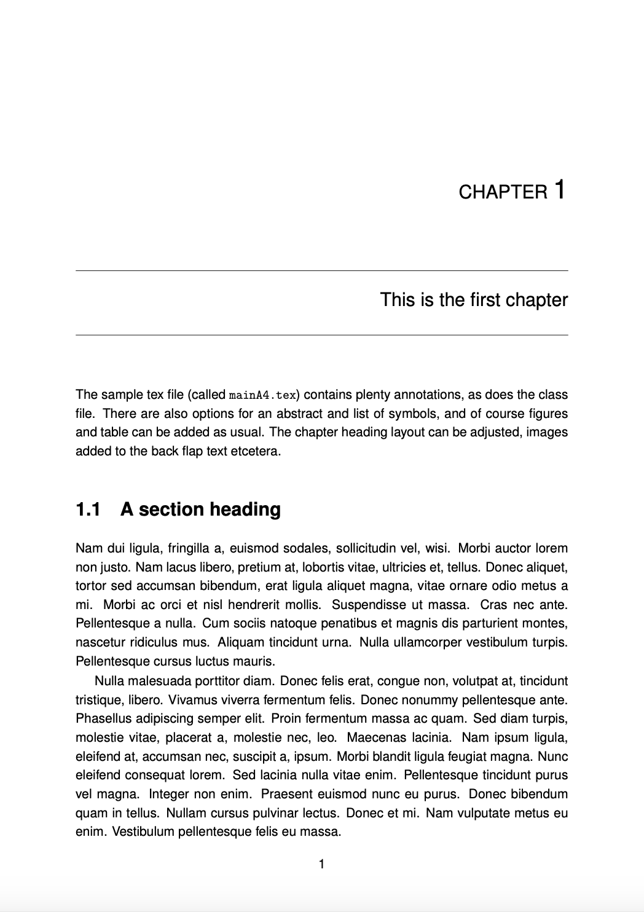

# Modern Basic book

A simplified book/'dissertation template' with prettier layout options to give it a modern look-and-feel and predefined features for books and translated books.

## About the original template

The original template was created by the ILLC in Amsterdam by Maarten de Rijke, which made its way to FUB where I adapted it for the dissertations there, and from there to a modern layout with features more typical of books. 

## Adaptations to FUBCS

I took that FUBCS guide and gave it a modern look-and-feel a while ago. Some of the changes include the following aspects.

Added:
- An option for translation and notes thereto
- Biographical sketches rather than a CV and publications
- Image on the front page, though nowadays there are better options
- both footnotes and endnotes
- natbib
- spacing

Modified:
- index heading
- more annotations in the tex on how and where to customise
- simplified text in the chapters, assuming a mainly text-based usage
- did not show, though could be used, other features, such as the abstract and a list of symbols.

Removed:
- The core explanatory text that has many small subsections rather than giving the look-and-fee of swathes of text. See FUBCSguide for those details.

## Examples

Look-and-feel screenshot: 

The example/example.pdf is the typesetted main.tex.

For a complete document typesetted with actual content, see The Nonviolent Personality at http://www.meteck.org/files/NonviolentPersonality.pdf.

## License

No copyleft license was specified, as the old files were from an era where hardly any bothered specifying it whilst assuming such templates were simply free to use and intended for use. This template is **CC-BY-NC-SA 3.0**. 
This is intended to mean that you can't make money from selling these  templates and if you revise them, please do share that alike. You're free to use the templates in whatever way you see fit for your book or dissertation. This licence does not apply to the product you create using the template that you can copyright/copyleft as you like, and that I wish you all the best with in making money from it if you so prefer.
